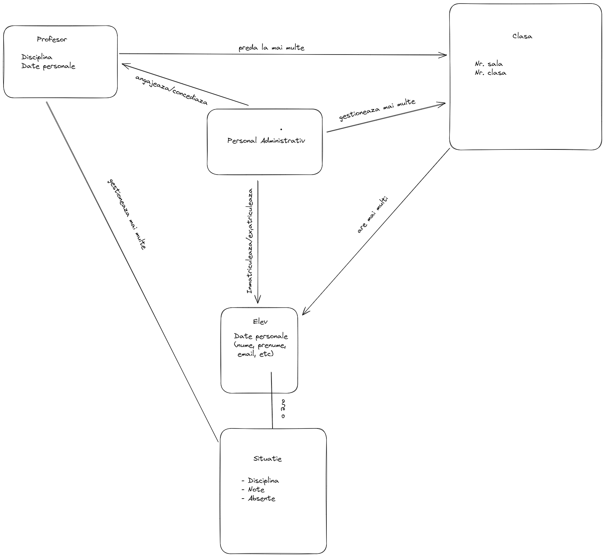

# Nume proiect

Gestionarea unei scoli (institutie de invatamant)

## Continut

Gestionarea unei scoli are in vedere gestionarea situatiei elevilor de catre profesor si a profesorilor de catre personalul administrativ.

In fisierul "util.hpp" avem niste structuri ajutatoare pentru Discipline, Datele unui om si situatia unui elev.
In fisierul "oameni.hpp" avem cele 5 clase principale:
- Elev
- Clasa
- Profesor
- Scoala
- Admin

## Functionalitate

### Profesorul:
- Preda la mai multe Clase
- Adauga si sterge notele elevilor
- Adauga si motiveaza absentele elevilor

### Personalul Administrativ:
- Este angajat la o scoala
- Angajeaza si concediaza profesori
- Inmatriculeaza, muta sau exmatriculeaza elevi dintr-o clasa
- Poate exmatricula un elev dintr-o scoala
- Stabileste profesorii de la o clasa

## Poveste pentru teste

Elevul Marcel Ionescu, elev la clasa a VII-a B, este un copil bun la invatatura. Are 10 la toate materiile, mai putin la sport, unde are 5 :(.
Din cate puteti deduce, Marcel nu este un copil prea activ si nu stie sport :))
Acest lucru il face pe colegul lui Mirel-Mugurel-Mihnea Marinescu, un copil fix opus la invatatura fata de Marcel, sa ii dea bully zilnic lui Marcel.
Intr-o zi, Marcel s-a saturat si i-a spus directorului (Bob Bentley). Mai intai directorul a incercat sa il mute pe Mirel de la B la C, dar fara de folos. 
Mirel devenea din ce in ce mai rau pe zi ce trece (snitches get stiches) si a inceput si mai rau sa fie. Chiulea de la orele de Geografie de la el, doar ca sa se duca la ora lui Marcel de sport sa isi bata joc de el, dar le motiva usor cu o scutire falsificata "de la parinti".
Marcel iar s-a suparat si i-a spus directorului care l-a exmatriculat pe Mirel de tot din scoala.
To be continued...

## Referințe

Notați aici ce alte resurse ați folosit / găsit utile pe parcursul dezvoltării proiectului.

https://www.edrawmax.com/templates/1024810/ (pentru a vedea ce face efectiv personalul administrativ)
Sfantul Google Search:
- Pentru a vedea cum se pune o imagine intr-un markdown

Geeksforgeeks pentru chestii basic de sintaxa
[cppreference enum](https://en.cppreference.com/w/cpp/language/enum)

